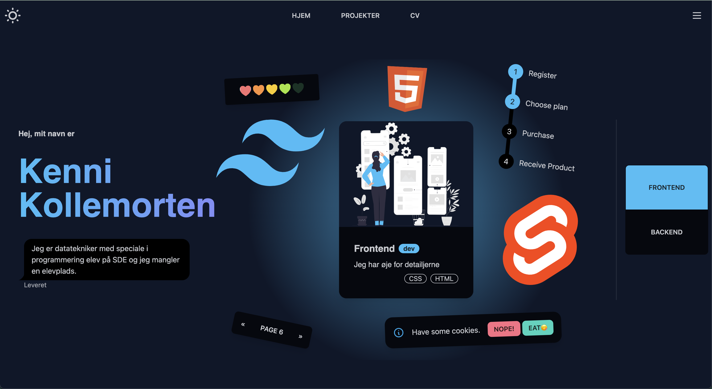

<br/>
<p align="center">
  <h3 align="center">My portfolio website</h3>

  <p align="center">
    A SSR and SPA website build with SvelteKit, featuring my coding projects.
    <br/>
    <br/>
    <a href="https://github.com/kenn7575/kenni-kollemorten-v2"><strong>Explore the docs »</strong></a>
    <br/>
    <br/>
  </p>
</p>

   

## Table Of Contents

* [About the Project](#about-the-project)
* [Features](#features)
* [Getting Started](#getting-started)
* [License](#license)

## About The Project



This is a updated version of my previous portfolio website.
[Live demo](https://portfolio-website-be4ca.web.app/)


## Features

On the frontend, i used Tailwind, DaisyUI and Svelte.
The backend is build with SvelteKit and Firebase.

1. Dark and light theme 🌙
2. Server side rendering(SSR) on first page load, then acts as single page app(SPA) ⚡️
3. Page prerendering on link hover. 
4. Fetches dynamic data from firebase on the server. 🔥
5. Secure admin page to upload and administrate projects. 🔑
6. Intelligent images 🪄
   * Optimized webp images in 2 resolutions (very low, standard). 
   * Renders low-res image frist and fades the standard image in on top when loaded.
8. High accessibility and page performance. ✅
9. Scroll animations. 🌈


## Getting Started

Explore this project by...


1. Clone the repo

```sh
git clone https://github.com/kenn7575/kenni-kollemorten-v2.git
```

2. Install NPM packages

```sh
npm i
```

3. Start dev server

```sh
npm run dev
```


## License

Apache License Version 2.0


